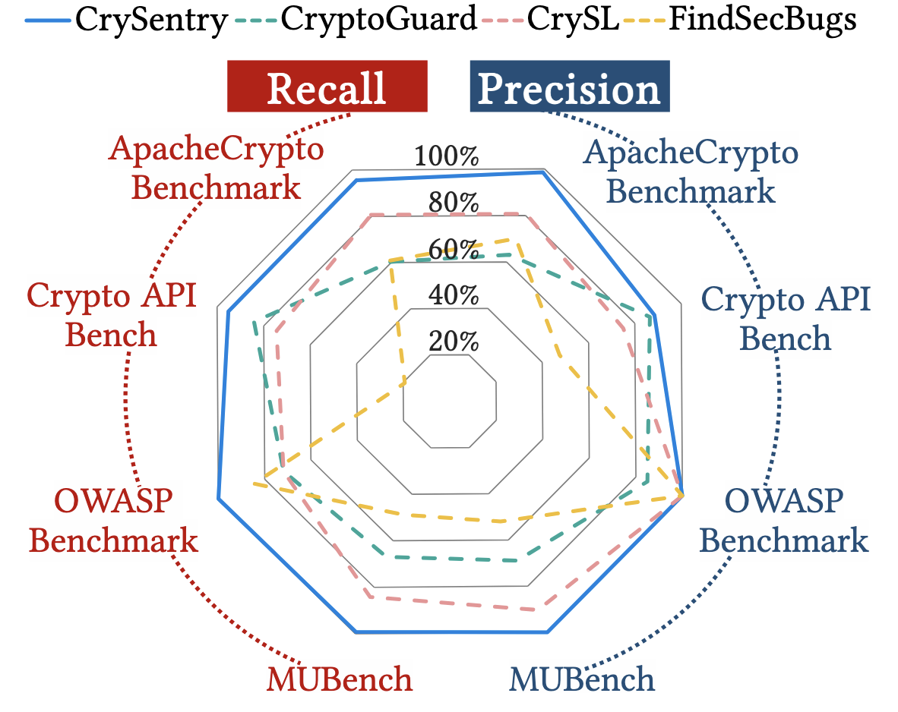
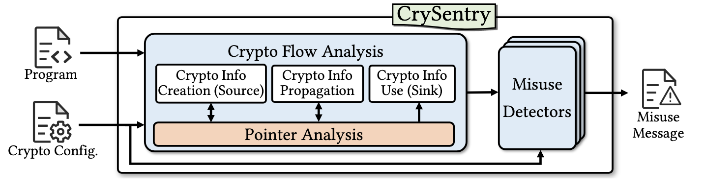

# CrySentry: A Static Analysis Tool for Java Crypto API Misuse Based on Tai-e

CrySentry is a static analysis tool for detecting **Java cryptographic API misuses** based on Tai-e whole-program pointer analysis and taint analysis.


---
## Features
The current implementation supports multiple classes of crypto API misuse detection, including:

- weak or deprecated cryptographic algorithms,
- predictable or non-cryptographically secure sources,
- invalid iteration counts or key sizes,
- unsafe or forbidden cryptographic API usages,
- missing or insufficient security checks,
- and composite misuse patterns involving multiple conditions.

---

## Why CrySentry?


"Cryptography is a vital technology that underpins the security of information in computer networks".
As the cornerstone of modern security frameworks, cryptography is crucial for protecting sensitive data, safeguarding transactions and communications, authenticating identities, and more.


The Java platform provides cryptography-related functionalities through the Java Cryptography Architecture (JCA) and the Java Secure Socket Extension (JSSE), enabling encryption, key generation, secure communication, and other tasks.

However, the complexity of crytpo API usage, combined with developers' general lack of security knowledge, often results in cryptographic API (crypto API) misuses, leading to security vulnerabilities such as sensitive data leaks, broken authentication, and man-in-the-middle attacks.

Existing crypto API misuse detectors still suffer from false negatives caused by restricted interprocedural tracking and insufficient alias analysis, as well as false positives introduced by coarse-grained detection rules.

On four widely used crypto API misuse benchmark suites: MUBench, OWASP Benchmark, Apache Crypto API Bench, and Crypto API Bench, **CrySentry** achieves consistently better soundness (**97.5% average recall**) and precision (**96.7% precision**), compared with state-of-the-art tools including CryptoGuard, CrySL, and FindSecBugs.

<div align="center">
  
  <p><strong>Figure 1: Evaluation overview comparing CrySentry with existing tools.</strong></p>
</div>


---

## Overview

A major and challenging class of crypto API misuse involves insecure crypto information being used in security-sensitive API calls. CrySentry is designed to detect such misuses using Tai-e’s whole-program pointer analysis and taint analysis framework.

<div align="center">
  
  <p><strong>Figure 2: Overview of CrySentry.</strong></p>
</div>


CrySentry models:

- crypto-related information as **sources**,
- security-sensitive crypto APIs as **sinks**,
- and tracks the propagation of crypto information through Tai-e pointer analysis and taint analysis.
- For the collected crypto-related taint flows, CrySentry applies configurable misuse detectors to determine whether the flows indicate potential security risks or vulnerabilities (e.g., insecure crypto information in security-sensitive API calls).


Users can flexibly configure crypto sources, crypto sinks, propagation rules, and misuse detection rules, allowing CrySentry to be adapted to different APIs, frameworks, and security policies.

---

## Usage

CrySentry is executed through Tai-e’s standard entry point. To run the analysis, prepare an **options file** and pass it to Tai-e with `--options-file`:

```bash
java -jar tai-e.jar --options-file /path/to/options.yml
```

A minimal example of the options file is shown below:

```yaml
optionsFile: null
printHelp: false
classPath: []
appClassPath:
  - /crypto-benchmarks/activemq/original-classes.jar

mainClass: null
inputClasses: []
javaVersion: 8
prependJVM: false
allowPhantom: true
worldBuilderClass: pascal.taie.frontend.newfrontend.AsmWorldBuilder
outputDir: output/activemq
preBuildIR: false
worldCacheMode: false
scope: APP
nativeModel: true
planFile: null

analyses:
  pta: |
    plugins:[pascal.taie.analysis.pta.plugin.cryptomisuse.reachableplugin.CryptoReachablePlugin];
    crypto-output:crypto-output/activemq.json;
    crypto-config:src/test/resources/pta/cryptomisuse/crypto-config.yml;
    implicit-entries:false;
    only-app:false;
    merge-string-builders:true;
    cs:1-call;
    advanced:hashmap;
    propagate-types:[reference,byte,char,int];


onlyGenPlan: false
keepResult:
  - $KEEP-ALL
jreDir: null
extractAllClasses: false
noAppendJava: false
useNonParallelCWAlgorithm: false
frontendOptions: {}
```


### 1. Configure the target application

The option `appClassPath` specifies the Java program to be analyzed.

`appClassPath` is a list, so you can provide:

* a directory that contains application JARs,
* multiple JAR files,
* or a mix of relative and absolute paths.

For example:

```yaml
appClassPath:
  - /path/to/app/build/libs/app.jar
  - /path/to/another.jar
  - /path/to/benchmark-dir
```

CrySentry will treat these paths as the application under analysis. In practice, this means you should place the benchmark or target program here.

`classPath` is used for the **dependency libraries** of the application, such as third-party JARs or framework JARs required to resolve references during analysis.

The distinction between `appClassPath` and `classPath`, as well as their impact on the analysis, follows the semantics defined by Tai-e. For detailed information, please refer to the Tai-e documentation:
https://tai-e.pascal-lab.net/docs/current/reference/en/command-line-options.html

A typical setup is:

```yaml
appClassPath:
  - /crypto-benchmarks/activemq/original-classes.jar
classPath:
  - /path/to/dependency1.jar
  - /path/to/dependency2.jar
```

### 2. Set the analysis entry points

CrySentry provides a special plugin, `CryptoReachablePlugin`, to identify analysis entry points. This plugin marks **all methods in the application code as reachable entry points**, so the analysis can cover the whole application instead of being limited to a manually specified main method.

```yaml
plugins:[pascal.taie.analysis.pta.plugin.cryptomisuse.reachableplugin.CryptoReachablePlugin];
```

If this plugin is not enabled, CrySentry follows Tai-e's default behavior and starts the analysis from the configured main method.
Users may customize the analysis entry points by implementing their own entry-point finder. The implementation of `CryptoReachablePlugin` provides a simple example that can be adapted to support application-specific entry-point discovery strategies.

Other Tai-e plugins can also be used in the same way.

### 3. Configure CrySentry in the PTA option block

CrySentry is configured inside the `pta` analysis section. The following options are the key ones:

```yaml
crypto-output:crypto-output/activemq.json;
crypto-config:src/test/resources/pta/cryptomisuse/crypto-config.yml;
```

* `crypto-output` specifies where CrySentry writes the detection results.
* `crypto-config` specifies the crypto misuse rules and propagation rules used by the detector.

**Both options are required to enable crypto misuse detection. If either option is missing, Tai-e will perform pointer analysis only, and CrySentry's crypto misuse analysis will not be activated.**

The rest of the PTA options are Tai-e settings that control pointer analysis behavior, such as context sensitivity, heap abstraction, and analysis scope. These options affect analysis precision and scalability of the underlying pointer analysis, but CrySentry’s crypto detection logic itself is driven mainly by `crypto-output` and `crypto-config`.

A few commonly used settings are:

* `cs:1-call;` — use 1-call-site-sensitive pointer analysis.
* `advanced:hashmap;` — enable Tai-e's specialized analysis for HashMap.
* `propagate-types:[reference,byte,char,int];` — enable propagation for the primitive types commonly involved in cryptographic computations. This option is highly recommended; disabling propagation of these types may cause CrySentry to miss relevant data flows and lead to unsound detection results.
* `merge-string-builders:true;` — treat all `StringBuilder` instances as a single object in pointer analysis.

### 4. Understand the crypto configuration file

The `crypto-config.yml` file defines the actual detection logic. CrySentry uses it to identify insecure API usages, track crypto-related values, and recognize misuse patterns.

The configuration is organized into several groups.

#### 4.1 `patternMatchRules`

These rules detect insecure algorithms or insecure API arguments by matching string patterns at specific call sites.

Example:

```yaml
patternMatchRules:
  - { method: "<javax.crypto.Cipher: javax.crypto.Cipher getInstance(java.lang.String)>", index: 0, pattern: "(.)*DES(.)*|(.)*DESede(.)*|AES|..." }
```

This rule checks the first argument of `Cipher.getInstance(String)`. If the string object pointed to by this argument (i.e., the cryptographic algorithm name)  matches an insecure pattern such as `DES`, `RC4`, `Blowfish`, or `AES/ECB`, CrySentry reports a **Pattern Match** issue.

In general, `patternMatchRules` are used for:

* insecure cipher algorithms,
* weak message digests,
* weak MAC algorithms,
* insecure key generators,
* insecure signatures,
* insecure URL or network-related API usages.

#### 4.2 `predictableSourceRules`

These rules identify APIs whose arguments should be sufficiently random or unpredictable, but may receive predictable values.

Example:

```yaml
predictableSourceRules:
  - { method: "<javax.crypto.spec.SecretKeySpec: void <init>(byte[],java.lang.String)>", index: 0 }
  - { method: "<javax.crypto.spec.IvParameterSpec: void <init>(byte[])>", index: 0 }
  - { method: "<java.security.SecureRandom: void <init>(byte[])>", index: 0 }
```

These rules help detect cases where keys, IVs, salts, or passwords are derived from weak or predictable values. CrySentry reports such issues as **Predictable Source**.

#### 4.3 `cryptoSources`

These rules define crypto-related input sources that may be insecure or insufficiently random.

Example:

```yaml
cryptoSources:
  - { method: "<java.util.Base64$Decoder: byte[] decode(java.lang.String)>", type: "byte[]", index: result }
  - { method: "<java.util.Random: void nextBytes(byte[])>", type: "byte[]", index: 0 }
```

These sources model values such as pseudo-random outputs or externally provided data, which do not necessarily satisfy cryptographic security requirements.

When such values flow into crypto-sensitive APIs (e.g., key generation, IV construction, or encryption parameter specification), they may introduce risks such as weak randomness or attacker-controlled cryptographic inputs.

CrySentry tracks the propagation of these values and reports a potential misuse when they influence security-critical cryptographic operations.

#### 4.4 `numberSizeRules`

These rules detect invalid numeric parameters, such as too small iteration counts or key sizes.

Example:

```yaml
numberSizeRules:
  - { method: "<javax.crypto.spec.PBEParameterSpec: void <init>(byte[],int)>", index: 1, min: 1000, max: 50000 }
```

This rule checks whether the iteration count is within an acceptable range. Values outside the specified range are reported as a **Number Size** issue.

#### 4.5 `forbiddenMethodRules`

These rules specify APIs that should not be used.

Example:

```yaml
forbiddenMethodRules:
  - { method: "<javax.crypto.spec.PBEKeySpec: void <init>(char[])>" }
```

If an application invokes a forbidden method, CrySentry reports it as a direct misuse.


#### 4.6 `coOccurrenceRules`

These rules describe APIs that must be considered together when detecting certain security conditions.

Example:

```yaml
coOccurrenceRules:
  - { method: "<javax.net.ssl.SSLSocketFactory: javax.net.SocketFactory getDefault()>", index: "['createSocket', '!<javax.net.ssl.HostnameVerifier: boolean verify(java.lang.String,javax.net.ssl.SSLSession)>']" }
```

These rules are used to detect combinations of API behaviors that together indicate insecure usage, such as using an SSL socket factory without proper hostname verification.

#### 4.7 `influencingFactorRules`

These rules capture methods whose return values or exception behavior influence security decisions.

Example:

```yaml
influencingFactorRules:
  - { method: "void checkClientTrusted(java.security.cert.X509Certificate[],java.lang.String)", index: exception, factor: null, type: use }
  - { method: "java.security.cert.X509Certificate[] getAcceptedIssuers()", index: return, factor: "getAcceptedIssuers()", type: def }
```

These are useful for SSL/TLS-related checks, where security depends not only on direct API calls but also on whether trust validation is actually performed.

#### 4.8 `compositeRules`

These rules combine multiple rule types to express more complex misuse patterns.

Example:

```yaml
compositeRules:
  - compositeRule:
      fromSource:
        method: "<java.security.KeyPairGenerator: java.security.KeyPairGenerator getInstance(java.lang.String)>"
        index: result
        type: "java.security.KeyPairGenerator"
      toSources:
        - { method: "<java.security.KeyPairGenerator: java.security.KeyPairGenerator getInstance(java.lang.String)>", index: result, ruleType: "PatternMatch", ruleIndex: 0, pattern: "RSA" }
        - { method: "<java.security.KeyPairGenerator: void initialize(int)>", index: base, ruleType: "NumberSize", ruleIndex: 0, min: 2048, max: 10000 }
```

A composite rule says that a misuse is reported only when multiple conditions hold together, such as using an insecure algorithm and an insufficient key size.

### 5. Output format

CrySentry writes its detection results to the file configured by `crypto-output`, for example:

```yaml
crypto-output: crypto-output/activemq.json
```

Each result entry typically includes:

* `judgeType`: the type of misuse, such as `Pattern Match` or `Predictable Source`,
* `message`: a human-readable explanation,
* `callSite`: the detected API call site,
* `var`: the variable involved in the misuse,
* `calleeMethod`: the target API method,
* `sourceStmt` and `sourceMethod`: the statement and method where the insecure crypto value originates.
* `constantValue`: when the misuse is caused by a constant string,
* `subSignature`: the method in which the issue is reported.

For example, a `Pattern Match` result indicates that CrySentry found an insecure algorithm name passed to a crypto API:

```json
{
  "judgeType" : "Pattern Match",
  "message" : "The algorithm used in this API call, is insecure and may lead to data leakage due to vulnerability to attacks.",
  "callSite" : "<...> invokespecial key.<init>($-v10, $-c9)",
  "var" : "$-c9",
  "constantValue" : "Blowfish",
  "calleeMethod" : "<javax.crypto.spec.SecretKeySpec: void <init>(byte[],java.lang.String)>"
}
```

In this example, the insecure cryptographic algorithm string "Blowfish" is propagated as a constant value and flows into the second argument `$-c9` of the call site invokespecial `key.<init>($-v10, $-c9)`. Since this argument is used as the algorithm parameter of SecretKeySpec, CrySentry identifies it as a weak cryptographic algorithm usage and reports a Pattern Match issue.

A `Predictable Source` result indicates that a value used in a crypto-sensitive API is not sufficiently random:

```json
{
  "judgeType" : "Predictable Source",
  "message" : "The value of the API is not well randomized",
  "callSite" : "<...> invokespecial spec.<init>(chars, salt, $-v19, $-v20)",
  "var" : "chars",
  "calleeMethod" : "<javax.crypto.spec.PBEKeySpec: void <init>(char[],byte[],int,int)>"
}
```

In this example, the result indicates that the `chars` argument in the call site `invokespecial spec.<init>(chars, salt, $-v19, $-v20)` is derived from an inappropriate or insufficiently random source, which is not suitable for cryptographic use. As a result, CrySentry flags this usage as a Predictable Source issue.

### 6. A typical workflow

A typical CrySentry run looks like this:

1. Put the application JARs into `appClassPath`.
2. Put dependency JARs into `classPath`.
3. Configure `crypto-config.yml` with the desired misuse rules.
4. Set `crypto-output` to the output JSON file.
5. Configure other pointer analysis options (e.g., context sensitivity).
6. Run Tai-e with `--options-file`.
7. Inspect the generated JSON report.
